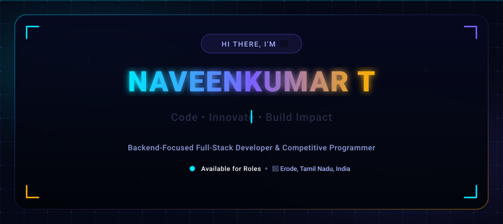
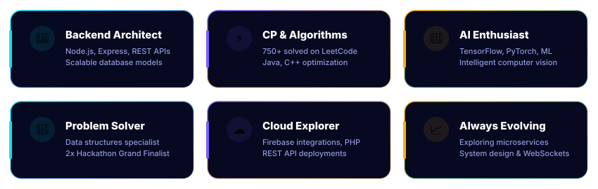
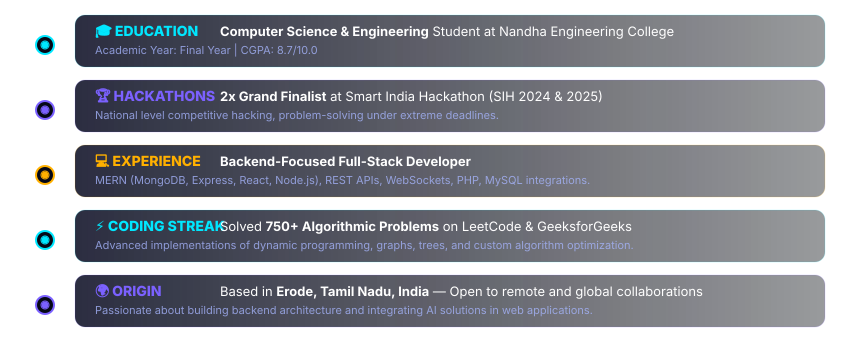
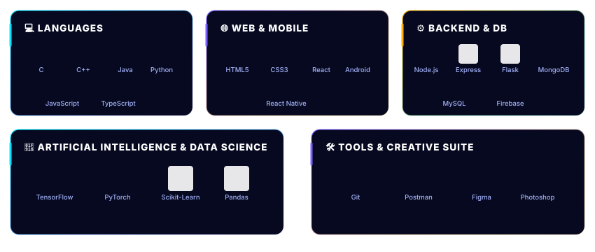
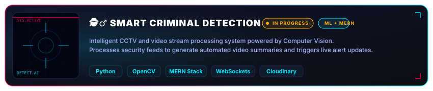
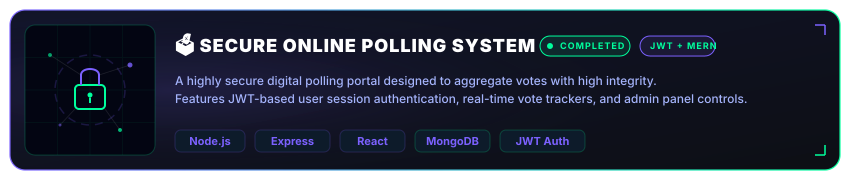
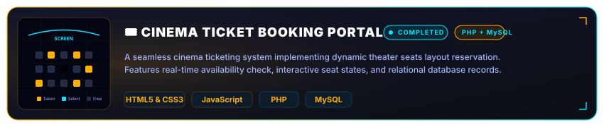

<!-- 
  ══════════════════════════════════════════════════════════════════
  README.md — Premium GitHub Profile
  Naveenkumar T — Full-Stack Developer & Software Engineer
  ══════════════════════════════════════════════════════════════════
-->

<div align="center">

<!-- ═══════════════ ANIMATED BANNER (SVG-BASED) ═══════════════ -->
<p align="center">
  
</p>

<!-- ═══════════════ SOCIAL / STAT BADGES ═══════════════ -->
<p align="center">
  
</p>

<p align="center">
  <a href="https://www.linkedin.com/in/naveenkumar-t-683306320/" target="_blank">
    
  </a>
  &nbsp;&nbsp;&nbsp;&nbsp;
  <a href="mailto:naveenkumart906@gmail.com">
    
  </a>
  &nbsp;&nbsp;&nbsp;&nbsp;
  <a href="https://leetcode.com/u/Naveenkumar7125/" target="_blank">
    
  </a>
</p>

</div>

<p align="center">
  
</p>

<!-- ═══════════════════════════════════════════════════════════
     ABOUT ME & ENGINEERING MINDSET
═══════════════════════════════════════════════════════════ -->

## 🧑‍🚀 About Me & Engineering Mindset

<table>
<tr>
<td width="100%" valign="top">

```yaml
developer:
  name: "Naveenkumar T"
  role: "Full-Stack Developer & Software Engineer"
  location: "Tamil Nadu, India"
  education: "Bachelor of Engineering (B.E.)"
  metrics:
    leetcode: "750+ Solved Problems"
    hackathons: "2x SIH National Grand Finalist"
  focus_areas:
    - "High-performance MERN web architectures"
    - "Computer Vision & Video Analytics (OpenCV)"
    - "Robust and secure API integrations"
  currently_building: "Suspect detection workflows & optimized reservation systems"
  interests: "Multi-agent AI networks, database performance & real-time analytics"
```

</td>
</tr>
</table>

<details>
<summary><b>🧠 Engineering Mindset & Approach (Click to Expand)</b></summary>
<br/>

I thrive at the intersection of robust backend engineering and analytical problem-solving. Whether it's optimization of transactional locks to prevent double-booking or configuring custom real-time WebSockets to broadcast surveillance alerts, I am passionate about crafting code that is both clean and highly performant. With a solid foundation in data structures and algorithm design (demonstrated through 750+ LeetCode solutions), I approach software engineering with a structured, optimization-first philosophy.

</details>

<p align="center">
  
</p>

<!-- ═══════════════════════════════════════════════════════════
     CORE FOCUS & SPECIALIZATIONS
═══════════════════════════════════════════════════════════ -->

## 🚀 Core Focus & Specializations

<p align="center">
  
</p>

<p align="center">
  
</p>

<!-- ═══════════════════════════════════════════════════════════
     JOURNEY & BACKGROUND
═══════════════════════════════════════════════════════════ -->

## 👨‍💻 Journey & Background

<p align="center">
  
</p>

<p align="center">
  
</p>

<!-- ═══════════════════════════════════════════════════════════
     TECH ECOSYSTEM
═══════════════════════════════════════════════════════════ -->

## 🛠️ The Tech Ecosystem

<p align="center">
  
</p>

<p align="center">
  
</p>

<!-- ═══════════════════════════════════════════════════════════
     COMPETENCY DASHBOARD
═══════════════════════════════════════════════════════════ -->

## 📈 Competency Dashboard

<p align="center">
  
</p>

<p align="center">
  
</p>

<!-- ═══════════════════════════════════════════════════════════
     FEATURED DEPLOYMENTS
═══════════════════════════════════════════════════════════ -->

## 📁 Featured Deployments

### 1. 🕵️‍♂️ Smart Criminal Detection
<p align="center">
  
</p>

<details>
  <summary><b>🔍 View Deep Dive: Features, Architecture &amp; Repository</b></summary>
  <br>

  #### 🚀 Key Features
  - **Live Edge Processing:** Processes real-time CCTV feeds and upload streams for automated activity analysis.
  - **Dynamic Video Summarization:** Converts long surveillance footage into condensed, searchable intelligence reports.
  - **Real-Time Notification Core:** Dispatches instant warnings to operators when suspect patterns are identified.

  #### 🌐 Architecture Diagram
  ```
  [ CCTV Feeds / Uploads ] ──> [ OpenCV + Python ML Engine ]
                                      │ (Intelligent Frame Extraction)
                                      ▼
  [ MERN Stack Dashboard ] <── [ WebSocket API (Node.js) ]
         │ (Admin Alerts)             │
         ▼                            ▼
  [ Live Feed Client ]         [ Cloudinary CDN Media Storage ]
  ```

  #### 📂 Highlight Repository
  - **Codebase:** [Smart Criminal Detection GitHub Repository](https://github.com/Naveenkumar7125) *(In Progress)*
  - **Status:** Under active development; ML module integration phase.
</details>

<br>

### 2. 🗳️ Secure Online Polling System
<p align="center">
  
</p>

<details>
  <summary><b>🔍 View Deep Dive: Features, Architecture &amp; Repository</b></summary>
  <br>

  #### 🚀 Key Features
  - **Tamper-Proof Authentication:** Restricts duplicate vote logging through secure token signature hashing.
  - **Real-Time Dashboard:** Features live aggregate vote charts, counting analytics, and state updates.
  - **Admin Control console:** Administrative board to initiate, terminate, or create dynamic poll criteria.

  #### 🌐 Architecture Diagram
  ```
  [ Client Browser (React) ] ──(JWT Token + Poll Option Request)──> [ API Gateway (Express) ]
                                                                             │
                                                                             ▼
  [ Live Chart Updates ] <───(Server-Side Aggregations)─────────── [ MongoDB Datastore ]
  ```

  #### 📂 Highlight Repository
  - **Codebase:** [Secure Online Polling System GitHub Repository](https://github.com/Naveenkumar7125)
  - **Demo:** [Request Digital Sandbox access](mailto:naveenkumart906@gmail.com)
</details>

<br>

### 3. 🎟️ Cinema Ticket Booking Portal
<p align="center">
  
</p>

<details>
  <summary><b>🔍 View Deep Dive: Features, Architecture &amp; Repository</b></summary>
  <br>

  #### 🚀 Key Features
  - **Interactive Seat Allocator:** Dynamic, visual grid layout showcasing available, taken, and selected seats.
  - **Lock Aggregation:** Handles rapid database transaction checkups to avoid double-bookings.
  - **Relational Integrity:** Implements normalized structure mapping shows, auditoriums, tickets, and user accounts.

  #### 🌐 Architecture Diagram
  ```
  [ Frontend GUI (JS + HTML5/CSS3) ] ──(Transactional Post Request)──> [ PHP Core Controller ]
                                                                               │
                                                                               ▼
  [ Seating Layout update ] <────────(Transaction State Update)────── [ MySQL Relational DB ]
  ```

  #### 📂 Highlight Repository
  - **Codebase:** [Cinema Booking Portal GitHub Repository](https://github.com/Naveenkumar7125)
</details>

<p align="center">
  
</p>

<!-- ═══════════════════════════════════════════════════════════
     HONORS & ACHIEVEMENTS
═══════════════════════════════════════════════════════════ -->

## 🏆 Honors & Achievements

<div align="center">
  <a href="https://github.com/ryo-ma/github-profile-trophy">
    
  </a>
</div>

<br/>

<table>
  <tr>
    <td>🥇</td>
    <td><b>National Grand Finalist Solver</b> — Smart India Hackathon (SIH 2025)</td>
  </tr>
  <tr>
    <td>🥇</td>
    <td><b>National Grand Finalist Solver</b> — Smart India Hackathon (SIH 2024)</td>
  </tr>
  <tr>
    <td>⚡</td>
    <td><b>Competitive Programming Enthusiast</b> — Solved 750+ advanced DSA & algorithmic challenges on Leetcode / GeeksforGeeks</td>
  </tr>
</table>

<p align="center">
  
</p>

<!-- ═══════════════════════════════════════════════════════════
     GIT INTELLIGENCE & ACTIVITY
═══════════════════════════════════════════════════════════ -->

## 📊 Git Intelligence & Activity

<div align="center">

<table border="0" cellpadding="0" cellspacing="0">
  <tr>
    <td>
      
    </td>
    <td>&nbsp;&nbsp;</td>
    <td>
      
    </td>
  </tr>
</table>

<br/>


<br/><br/>


<br/><br/>

<!-- Contribution Snake -->


</div>


<!-- ═══════════════════════════════════════════════════════════
     CURRENT FOCUS
═══════════════════════════════════════════════════════════ -->

## 🎯 Current Focus

- [x] Setting up WebSockets for real-time criminal detection alerts (Phase 1)
- [x] Reaching 750+ solved problems on Leetcode
- [ ] Integrating Deep Learning modules with the core Python OpenCV video intelligence microservice
- [ ] Optimizing Relational Transaction Locks for scalable seat allocations
- [ ] Deepening knowledge of microservices & distributed caches (Redis)

<p align="center">
  
</p>

<!-- ═══════════════════════════════════════════════════════════
     INTERACTIVE QUOTE
═══════════════════════════════════════════════════════════ -->

<div align="center">

### 💭 Dev Philosophy


</div>

<p align="center">
  
</p>

<!-- ═══════════════════════════════════════════════════════════
     CONNECT
═══════════════════════════════════════════════════════════ -->

## 🌐 Connect With Me

<div align="center">

<a href="https://www.linkedin.com/in/naveenkumar-t-683306320/" target="_blank">
  
</a>
&nbsp;&nbsp;
<a href="mailto:naveenkumart906@gmail.com">
  
</a>
&nbsp;&nbsp;
<a href="https://leetcode.com/u/Naveenkumar7125/" target="_blank">
  
</a>
&nbsp;&nbsp;
<a href="https://github.com/Naveenkumar7125">
  
</a>

</div>

<p align="center">
  
</p>

<!-- ═══════════════════════════════════════════════════════════
     FOOTER
═══════════════════════════════════════════════════════════ -->

<!-- Wave Footer Section -->
<p align="center">
  
</p>

<div align="center">
  <br/>
  <a href="#top"></a>
</div>
